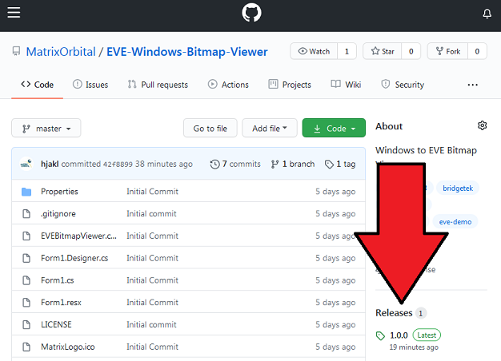
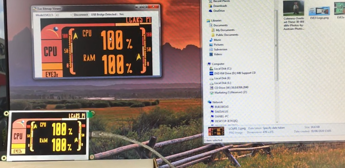

# Windows to EVE Bitmap viewer 

This is a sample application for Windows that will allow bitmaps to be displayed directly onto a [Matrix Orbital 
EVE2, EVE3 or EVE4 Series Display](https://www.matrixorbital.com/ftdi-eve) 

To use this application you will require 

[USB 2 SPI](https://www.matrixorbital.com/eve2-usb2spi-kit-a) module or
[EVE3x USB version](https://www.matrixorbital.com/index.php?route=product/search&search=eve3x) TFT Display

## Usage

- Plugin the USB2SPI or USB EVE3x display and [install the drivers](https://www.matrixorbital.com/index.php?route=download/download_category&dpath=6)

- Download the source or compiled version here

- Start the application

- Select the display size of your module  

- Click the Connect button

- Wait for the module to be detected  

If the display is detected properly you should now see the Matrix Orbital screen on your display.

Now you can drag any image file on to the application and it will appear on your display.

## [Watch the video here](https://www.youtube.com/watch?v=zGJ_HENTz3Y)

## Support Forums

http://www.lcdforums.com/forums/viewforum.php?f=45

## Code

The sample application is written in C# with a DLL version of the [Matrix Orbital Eve Library](https://github.com/MatrixOrbital/EVE2-Library) to handle the communication with the module.

